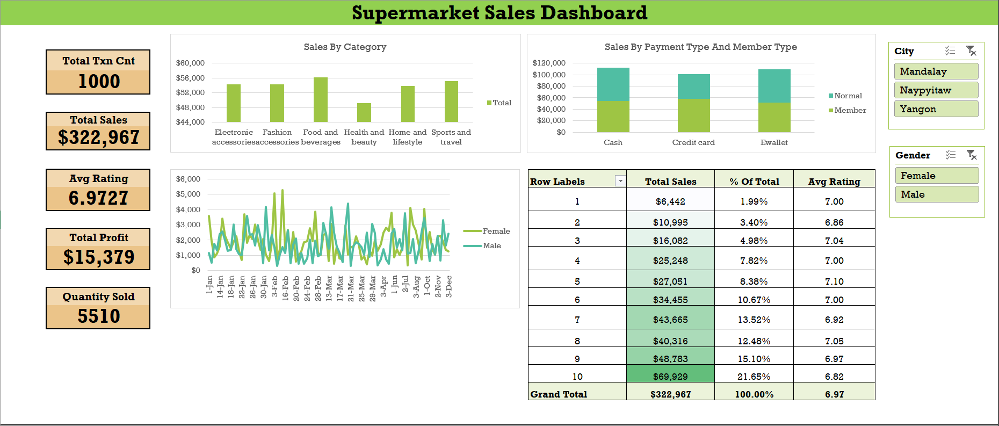
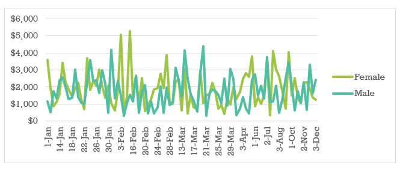
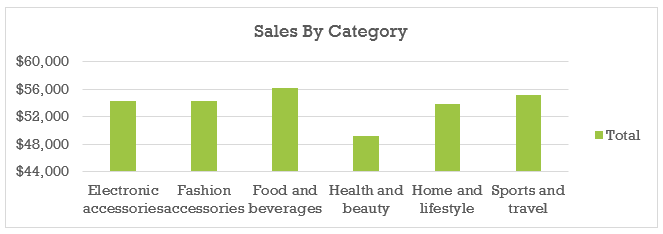

# Supermarket Sales Dashboard (Excel)

## Project Overview
Built an interactive Excel dashboard to analyze supermarket sales performance across categories, regions, and time.

## Tools Used
- Microsoft Excel
- Pivot Tables & Pivot Charts
- Slicers
- Advanced Excel formulas

## Key Insights
- Identified top-performing product categories
- Analyzed monthly sales trends
- Compared regional sales contribution

## Features
- Dynamic filtering using slicers
- KPI cards for quick performance overview
- Clean, dashboard-style layout

## Screenshots
## Dashboard Overview

## Sales Trend Analysis

## Category-wise Sales Analysis

